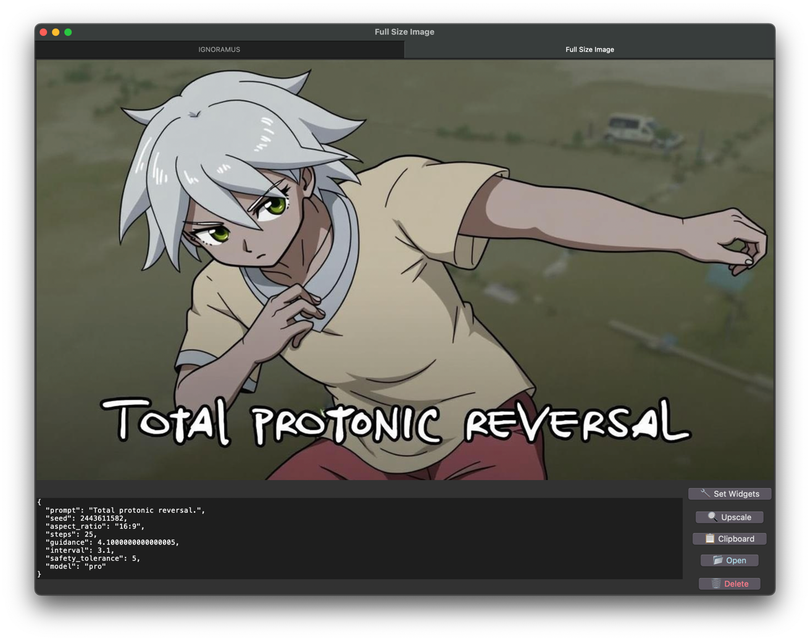

# IGNORAMUS

**I**mage **G**enerator: **N**onsense, **O**ddities, **R**andom **A**rt, and **M**ost **U**nusual **S**cenes

A Python-based graphical user interface for generating images using Flux models.

## Features

- Customizable parameters for each Flux model
- Image gallery with thumbnail previews
- Metadata storage in EXIF data
- Full-size image viewer with metadata display and settings recall for image

## Requirements

- Python 3.12 or higher
- Poetry for dependency management

## Dependencies

- replicate
- tqdm
- requests
- Pillow
- piexif

## Installation

1. Clone the repository
2. Install Poetry if you haven't already: https://python-poetry.org/docs/#installation
3. Navigate to the project directory
4. Run `poetry install` to set up the virtual environment and install dependencies
5. Acquire a Replicate API token from https://replicate.com/
6. Either create a `token.txt` file in the project directory and put your Replicate API token in it, or set the `REPLICATE_API_TOKEN` environment variable to your token.

## Usage

`poetry run python main.py`

## Development

This project uses Poetry for dependency management. To add or update dependencies, use the appropriate Poetry commands and embrace the chaos.

Prepare for a journey into the realm of the absurd and let IGNORAMUS guide your artistic exploration!
